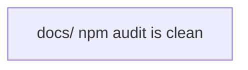

# Targets

## Active

### 🎯T5 docs/ npm audit is clean
- **Value**: 3
- **Cost**: 3
- **Acceptance**:
  - `cd docs && npm audit` reports 0 vulnerabilities
  - `cd docs && npm run build` succeeds with no new errors
  - No runtime regressions in the built docs site
- **Context**: 22 advisories remain in docs/ after the lodash fix (commit 0b34341) — 20 moderate, 2 high. All are stale transitive pins in Docusaurus 3.9.2's dependency tree:

- `serialize-javascript@7.0.4` (fixed in 7.0.5) — via `copy-webpack-plugin`, `terser-webpack-plugin`, `css-minimizer-webpack-plugin`
- `picomatch@2.3.1` (fixed in 2.3.2) — via `micromatch`, `chokidar`, `jest-worker`
- `brace-expansion@5.0.3` (fixed in 5.0.5) — via `serve-handler → minimatch`
- `path-to-regexp@0.1.12` (fixed in 0.1.13) — via `webpack-dev-server → express`

The Docusaurus-family entries (`@docusaurus/core`, all plugins, `preset-classic`) are cascade noise — only the leaves above are actually vulnerable; Docusaurus lights up because its dep cone contains them.

Severity-in-practice is low: these are build-time / dev-server deps, not shipped runtime code. A clean audit keeps Dependabot noise down and makes real alerts easier to spot.

How to approach:
- **Do NOT use `npm update`** — tried it on 2026-04-11; it pulls webpack forward past webpackbar compatibility (webpackbar passes `{name, color, reporters, reporter}` to webpack's `ProgressPlugin`, and the newer schema rejects them). Breaks `npm run build` with a `ValidationError`.
- **Preferred path: surgical overrides** in `docs/package.json` for each leaf (`serialize-javascript ^7.0.5`, `picomatch ^2.3.2`, `brace-expansion ^5.0.5`). `path-to-regexp` is trickier — three installed major versions (0.1.x via express, 1.9.0 via react-router, 3.3.0 via serve-handler) — may need per-path overrides.
- **Alternative: wait for upstream.** Docusaurus 3.10+ may ship newer transitive pins; re-check `npm audit` on each Docusaurus bump.
- Existing overrides in docs/package.json: `minimatch ^10.2.1`, `serialize-javascript ^7.0.4`, `lodash ^4.18.1`.

Relevant files: `docs/package.json`, `docs/package-lock.json`.
- **Tags**: security, docs, dependencies
- **Origin**: Surfaced 2026-04-11 while fixing lodash CVE GHSA-r5fr-rjxr-66jc (commit 0b34341). `npm audit` flagged 22 remaining advisories; triage showed they're all stale transitive pins, not genuinely unfixable.
- **Status**: Identified
- **Discovered**: 2026-04-11

## Achieved

### 🎯T1 Frozen read-path allocations are zero  [high, weight: 9]
- **Value**: 1
- **Cost**: 1
- **Acceptance**: TODO
- **Context**: Achieved 2026-03-07. Merged to frozen master as PR #88 (5b2842e). All benchmarks at 0 allocs for concrete key types, 1 alloc for interface keys.
- **Status**: Achieved
- **Discovered**: 2026-04-09
- **Achieved**: 2026-04-11

### 🎯T2 Frozen write-path allocations minimised  [medium, weight: 5]
- **Value**: 1
- **Cost**: 1
- **Acceptance**: TODO
- **Context**: Retired 2026-03-08. Benchmarking showed write-path allocations (3-18 for Map.With, 1-7 for Set.With) are structurally inherent to persistent data structures (spine-copying). Already reasonable for tree depth. Read-path fix (🎯T1) addressed the actual regression. No concrete workload shows write-path as a bottleneck.
- **Status**: Achieved
- **Discovered**: 2026-04-09
- **Achieved**: 2026-04-11

### 🎯T3 arrai v0.333.0 released  [high, weight: 8]
- **Value**: 1
- **Cost**: 1
- **Acceptance**: TODO
- **Context**: Achieved 2026-03-08. Release created automatically by generate-tag workflow. Tag `v0.333.0` on master, GitHub release with binaries for all platforms.
- **Status**: Achieved
- **Discovered**: 2026-04-09
- **Achieved**: 2026-04-11

### 🎯T4 Agent guide is discoverable from the repo root  [medium, weight: 5]
- **Value**: 1
- **Cost**: 1
- **Acceptance**: TODO
- **Context**: Achieved 2026-03-08. Root symlink `agents-guide.md` → `cmd/arrai/agents-guide.md`, README updated with agent guide section.
- **Status**: Achieved
- **Discovered**: 2026-04-09
- **Achieved**: 2026-04-11

## Graph

